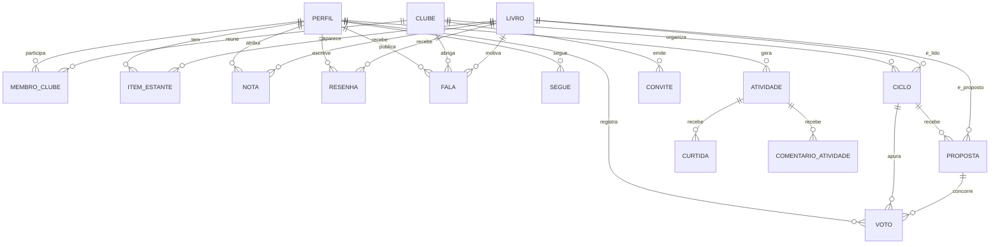

# Prosa — Arquitetura e modelo de dados

**Disciplina:** Interface Humano-Computador (IHC)
**Autor:** Kaue Cavalcante Wanderley de Melo
**Versão:** 1.0

Este documento descreve como o produto descrito em [requisitos.md](requisitos.md) se traduz em software. O esquema executável está em [schema.sql](schema.sql).

---

## 1. Visão geral

| Camada | Escolha | Por quê |
|---|---|---|
| Interface | React + Vite, instalável como PWA | Um código só serve celular e computador; instalável sem loja de aplicativo |
| Dados e autenticação | Supabase (PostgreSQL, Auth, Storage) | Elimina backend próprio num projeto solo, e a segurança fica no banco em vez de espalhada na aplicação |
| Catálogo de livros | Google Books, com Open Library como alternativa | Gratuito, sem chave obrigatória, cobre bem o catálogo brasileiro |
| Publicação | Vercel | Publicação automática a cada commit, com HTTPS, que o PWA exige |

O aplicativo fala direto com o Supabase. Não há servidor intermediário: as regras que um backend faria cumprir estão escritas como políticas de acesso no próprio banco (seção 5).

---

## 2. Modelo de dados



### As entidades

| Entidade | O que guarda | User stories |
|---|---|---|
| `perfil` | Nome, retrato ilustrado e a visibilidade de cada lista | US-01 a US-04, US-58 |
| `livro` | Metadados vindos da API, copiados para o nosso banco | US-13, US-14 |
| `clube` | Grupo fechado, com o combinado de convivência | US-05, US-12 |
| `membro_clube` | Quem está em qual clube e com qual papel | US-08, US-09 |
| `convite` | Código de entrada, com validade e revogação | US-06, US-07 |
| `ciclo` | Uma rodada de leitura: votação, livro escolhido e prazo | US-22, US-23 |
| `proposta` | Livro concorrendo no ciclo, com a frase de defesa | US-19 |
| `voto` | Um voto por pessoa por ciclo | US-20, US-21 |
| `item_estante` | O estado de cada livro para cada pessoa | US-28 a US-30 |
| `nota` | Avaliação de 0 a 5 | US-34, US-39 |
| `resenha` | Texto da avaliação, com marcação de spoiler | US-35 |
| `fala` | Mensagem da conversa do clube sobre um livro | US-36 a US-38, US-40 |
| `segue` | Grafo social | US-51, US-56 |
| `atividade` | Evento que alimenta o feed | US-52 |
| `curtida`, `comentario_atividade` | Interações do feed | US-54, US-55 |

---

## 3. Seis decisões que valem explicar

### 3.1 Não existe coluna de progresso, e isso é proposital

Nenhuma tabela guarda página atual ou percentual lido. O acompanhamento acontece só pelo campo `estado` de `item_estante`, com três valores: `futuro`, `lendo`, `lido`.

Isso vem do RNF-17 e da US-28. A razão é de produto, não técnica: exigir que a pessoa atualize a página manualmente é atrito que mata o uso. Ninguém abre um aplicativo todo dia para digitar "página 118".

Um desenvolvedor futuro vai achar natural adicionar `paginas_lidas`. O comentário no `schema.sql` existe para impedir isso.

### 3.2 O livro é copiado da API para o nosso banco

Na primeira vez que alguém propõe ou adiciona um livro, os metadados são gravados na tabela `livro` e todas as chaves estrangeiras passam a apontar para o nosso `id`.

Três motivos:

- **Estabilidade.** Um identificador do Google Books pode mudar ou sumir. O nosso não.
- **Custo.** Sem cópia, cada carregamento de tela dispararia uma chamada externa por livro. A API tem limite de uso — o projeto já bateu nele durante os testes.
- **Consistência.** Livro que veio do Google, do Open Library ou cadastrado à mão fica com a mesma forma. O resto do sistema não precisa saber a origem.

A coluna `fonte` registra de onde veio, e a restrição `unique (fonte, fonte_id)` impede duplicata do mesmo livro.

### 3.3 O estado revelado do spoiler nunca é gravado

A tabela `fala` tem uma coluna `spoiler`, que diz se aquela mensagem contém spoiler. Não existe coluna dizendo quem já revelou o quê.

Isso atende diretamente ao critério de aceitação da US-38: *o estado revelado não é compartilhado entre usuários*. A revelação é estado local do componente, vive enquanto a tela está aberta e morre com ela. Se fosse persistida, duas pessoas no mesmo clube poderiam interferir na experiência uma da outra — exatamente o que a funcionalidade existe para evitar.

É um caso em que **não** guardar o dado é a decisão de arquitetura.

### 3.4 O feed é gravado por gatilho, não pela aplicação

Quando alguém avalia, resenha ou adiciona um livro aos futuros, um gatilho no banco insere a linha correspondente em `atividade`.

A alternativa seria a aplicação inserir nas duas tabelas. O problema é que qualquer caminho que esqueça a segunda inserção — um script de importação, uma correção manual, uma tela nova — deixa o feed dessincronizado do que de fato aconteceu. Com gatilho, isso é impossível por construção.

### 3.5 O perfil nasce por gatilho, não pelo cliente

A função `cria_perfil_ao_cadastrar` roda `AFTER INSERT` em `auth.users` e grava a linha em `perfil`, lendo o nome de `raw_user_meta_data`.

É gatilho, e não política de insert, porque no cadastro com confirmação de e-mail ainda não existe sessão — e sem sessão `auth.uid()` é nulo, então nenhuma política resolveria esse instante. Como consequência, `perfil` **não tem política de insert**, e isso é proposital: o cliente nunca escreve nessa tabela.

A migração está em [migracoes/001-perfil-ao-cadastrar.sql](migracoes/001-perfil-ao-cadastrar.sql).

### 3.6 A conversa não tem trava de data

A `fala` não tem campo de liberação. Qualquer membro escreve a qualquer momento.

A versão anterior do projeto travava a conversa até uma data combinada, para proteger quem estava atrasado. A trava foi removida porque resolvia o problema errado: penalizava quem terminou primeiro para proteger quem ficou para trás.

A proteção continua existindo, e é melhor: a marcação de spoiler deixa cada pessoa escolher quando ler o quê. O `prazo` do ciclo permanece em `ciclo`, mas é meta de leitura, não bloqueio.

---

## 4. Estrutura do aplicativo

```
src/
  pages/          uma tela por arquivo, espelhando os wireframes
    Entrar.jsx         login, cadastro e pedido de recuperação
    NovaSenha.jsx      escolha da senha nova, a partir do link do e-mail
    Convite.jsx
    Clube.jsx
    Votacao.jsx
    Estante.jsx
    Livro.jsx
    Conversa.jsx
    Feed.jsx
    Perfil.jsx
    Buscar.jsx
  components/     peças reutilizáveis
    Marca.jsx          o balão com olhos, em tamanho variável
    CampoSenha.jsx     campo, medidor de força e mínimo, num lugar só
    CardLivro.jsx      capa com lombada, o elemento mais visível do app
    ChipEstado.jsx     cor + forma + rótulo, nunca só cor (RNF-12)
    Estrelas.jsx       nota de 0 a 5, em framboesa
    Spoiler.jsx        oculta por padrão, revela por ação individual
  lib/
    supabase.js        cliente único, criado uma vez
    mensagens.js       traduz falha em frase acionável (RNF-05)
    buscaLivros.js     Google Books com alternativa no Open Library
    estante.js         operações de mudança de estado
  hooks/
    useSessao.js
    useClube.js
  estilos/
    tokens.css         as variáveis de cor e tipografia do manual da marca
    base.css           reset, tipografia de base e foco visível
    formulario.css     a linguagem ilustrada das telas de acesso
```

O perfil não é criado pelo cliente. Quem cria é o gatilho `ao_criar_usuario`, descrito na seção 3.5 — por isso não existe um `lib/perfil.js`.

### Rotas

| Rota | Tela | Acesso |
|---|---|---|
| `/entrar` | Login e cadastro | Público |
| `/convite/:codigo` | Aceite de convite | Público, exige login para concluir |
| `/` | Feed | Autenticado |
| `/estante` | Estante pessoal | Autenticado |
| `/buscar` | Busca de livro | Autenticado |
| `/livro/:id` | Ficha, nota e resenhas | Autenticado |
| `/clube/:id` | Ciclo atual e membros | Membro do clube |
| `/clube/:id/votacao` | Votação | Membro do clube |
| `/clube/:id/livro/:livroId` | Conversa | Membro do clube |
| `/perfil/:id` | Perfil público | Autenticado |

### PWA

- `vite-plugin-pwa` gera o manifesto e o service worker.
- O casco do aplicativo entra em cache na instalação.
- As capas de livro usam estratégia *cache first* — são imagens que nunca mudam, e é o que mais pesa na tela.
- O modo offline completo (US-49) é fase 3. No MVP, sem conexão o aplicativo abre e avisa, em vez de quebrar.

---

## 5. Segurança

A segurança fica no banco, com *Row Level Security*, e não na interface. A razão é simples: a aplicação roda no navegador do usuário, então qualquer regra escrita só no front pode ser contornada por quem souber abrir o console.

As três regras que sustentam o resto:

**Clube é fechado.** As tabelas `clube`, `ciclo`, `proposta`, `voto` e `fala` só são legíveis por quem consta em `membro_clube`. A função `e_membro()` centraliza essa verificação.

**Escrita só em nome próprio.** Toda política de inserção exige `perfil_id = auth.uid()`. Ninguém vota, comenta ou avalia se passando por outra pessoa.

**A estante respeita a visibilidade do dono.** A política de `item_estante` consulta as colunas `vis_lidos` e `vis_futuros` do perfil antes de liberar a leitura. Isso é a US-58 aplicada no banco, e não apenas escondida na interface.

Além disso, o gatilho `nota_exige_lido` garante a regra da US-34 — só avalia quem marcou o livro como lido — mesmo que a interface deixe passar.

---

## 6. Ambiente

| Item | Valor |
|---|---|
| Projeto Supabase | `dhhcvrfuwfimhdpnnxmp` |
| URL da API | `https://dhhcvrfuwfimhdpnnxmp.supabase.co` |
| Região | São Paulo (`sa-east-1`) |
| Plano | Free |

As chaves de API e a senha do banco não ficam no repositório. Elas são lidas de variáveis de ambiente (`VITE_SUPABASE_URL` e `VITE_SUPABASE_ANON_KEY`), e o `.env` está no `.gitignore`.

---

## 7. Validação do esquema

O [schema.sql](schema.sql) foi executado do zero em PostgreSQL 17 local e no Supabase do projeto, criando 16 tabelas, 26 políticas de RLS, 5 gatilhos e 29 índices sem erro. Os testes de regra abaixo rodaram como superusuário, que ignora RLS — por isso eles verificam gatilhos e restrições, mas **não** verificam as políticas de acesso. O caminho real de cadastro só passou a funcionar com a migração [001-perfil-ao-cadastrar.sql](migracoes/001-perfil-ao-cadastrar.sql).

As regras de negócio foram testadas uma a uma:

| Teste | Esperado | Resultado |
|---|---|---|
| Avaliar livro que não está marcado como lido | Recusar | Recusou — gatilho `exige_livro_lido` |
| Marcar como lido e avaliar | Aceitar | Aceitou |
| Nota fora da faixa de 0 a 5 | Recusar | Recusou — restrição `nota_valor_check` |
| Prazo de ciclo no passado | Recusar | Recusou — gatilho `exige_prazo_futuro` |
| Prazo de ciclo no futuro | Aceitar | Aceitou |
| Avaliação alimenta o feed | Gerar atividade | Gerou uma atividade do tipo `avaliou` |
| Seguir a si mesmo | Recusar | Recusou — restrição `nao_segue_a_si` |

---

## 8. Limites conhecidos

| Limite | Consequência | Quando resolver |
|---|---|---|
| O feed lê `atividade` sem paginação por cursor | Fica lento depois de alguns milhares de linhas | Quando houver volume real |
| Sem moderação de conteúdo | Depende do clube ser fechado e pequeno | Fora de escopo, ver requisitos.md |
| Busca de livro sem cache entre sessões | Repetir a mesma busca gasta chamada da API | Fase 3, junto com o modo offline |
| Sem transferência de administração do clube | O criador não consegue sair do próprio clube | Junto de US-11 |
